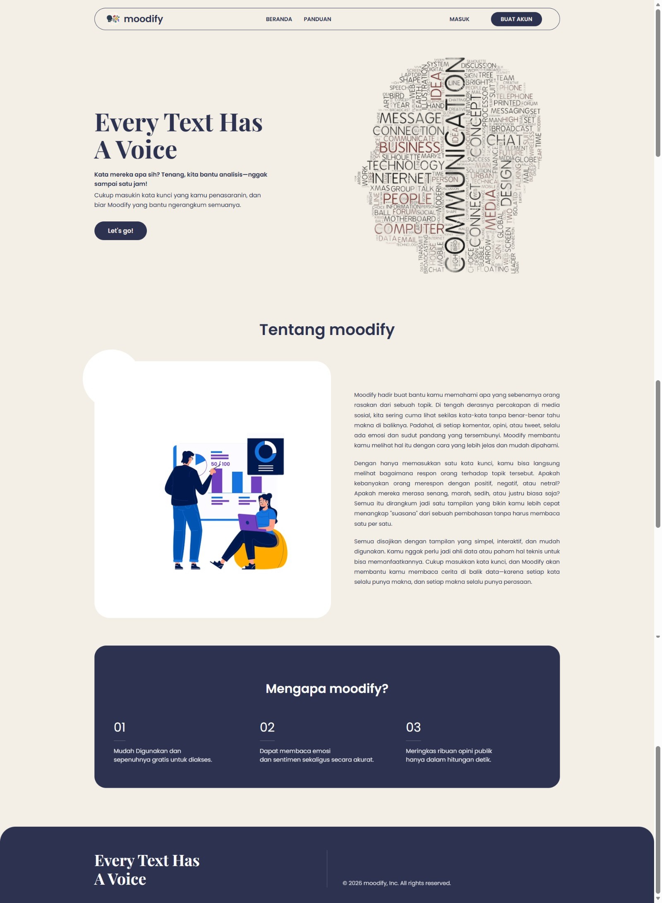

# 🕵️‍♂️ moodify - Analisis Sentimen & Emosi Tweet

**moodify** adalah aplikasi web Flask yang dirancang untuk menganalisis sentimen (positif, negatif, netral) dan emosi (senang, sedih, marah, dll.) dari cuitan (tweet) X/Twitter.

Aplikasi ini menggunakan model Hugging Face kustom yang dilatih secara spesifik untuk bahasa Indonesia (`Ha1dir/sentimen-indobert` dan `Ha1dir/emosi-indobert`) untuk memberikan hasil analisis yang mendalam.



---

## 🚀 Fitur Utama

- **Scraping Tweet:** Mengambil data tweet langsung dari X/Twitter berdasarkan kata kunci, rentang tanggal, dan jumlah.
- **Preprocessing Teks Lanjut:**
  - Membersihkan teks dari URL, _mention_, _hashtag_, dan angka.
  - **Normalisasi Kamus:** Menggunakan file yang diambil dari https://github.com/meisaputri21/Indonesian-Twitter-Emotion-Dataset.
  - _Tokenizing_, _Stopword Removal_, dan _Stemming_ menggunakan Sastrawi.
- **Analisis Model Kustom:** Menggunakan model Hugging Face kustom (`Ha1dir/`) untuk memprediksi sentimen dan emosi.
- **Visualisasi Data:**
  - **Word Cloud:** Menampilkan kata-kata yang paling sering muncul dalam data.
  - **Pie Charts:** Visualisasi interaktif untuk distribusi sentimen dan emosi menggunakan Chart.js.
- **Antarmuka yang Ramah:**
  - Halaman tutorial untuk memandu pengguna mendapatkan `auth_token`.
  - Tampilan _loading_ dinamis saat proses analisis sedang berjalan.

---

## 🛠️ Teknologi yang Digunakan

- **Backend:** Flask
- **Frontend:** HTML, CSS, JavaScript
- **Data Scraping:** `tweet-harvest` (dijalankan via `npx`)
- **Analisis ML/NLP:** `transformers` (Hugging Face), `torch`
- **Preprocessing Teks:** `pandas`, `nltk`, `Sastrawi`
- **Visualisasi:** `wordcloud`, `Chart.js`

---

## 📂 Struktur Folder

Proyek ini diorganisir dengan memisahkan logika inti dari aplikasi web utama untuk keterbacaan yang lebih baik.

```
proyek-anda/
├── app.py              # File utama Flask (Routes & Logic)
├── kamus_gaul.csv      # Kamus normalisasi (PENTING!)
├── requirements.txt    # Daftar library Python
├── static/
│   ├── assets/         # Logo, gambar tutorial, dan wordcloud.png
│   ├── style.css       # CSS untuk Home
│   ├── form-style.css  # CSS untuk Form Analisis
│   └── ...
├── templates/
│   ├── index.html      # Landing Page
│   ├── analisis.html   # Halaman Form
│   ├── result.html     # Halaman Hasil
│   └── tutorial.html   # Halaman Tutorial
└── utils/              # Folder untuk logika inti
|    ├── __init__.py
|   ├── preprocessing.py  # Fungsi cleaning & normalisasi kamus
|   ├── models.py         # Fungsi load & predict model
|  └── scraping.py       # Fungsi scraping & analisis utama
└── tweets-data


---

## ⚙️ Instalasi & Penggunaan

Ikuti langkah-langkah ini untuk menjalankan proyek di komputer lokal Anda.

### 1. Prasyarat

- **Python** (3.9 atau lebih baru)
- **Node.js & npm:** Diperlukan untuk menjalankan `npx tweet-harvest`.
- **Git** (Opsional, untuk kloning)

### 2. Kloning Repositori

```bash
git clone https://github.com/idrishaidir/analisis-sentimen-dan-emosi.git
cd analisis-sentimen-dan-emosi
```

### 3. Siapkan Environment Python

Sangat disarankan untuk menggunakan _virtual environment_.

```bash
# Buat virtual environment
python -m venv venv

# Aktifkan (Windows)
.\venv\Scripts\activate

# Aktifkan (Mac/Linux)
source venv/bin/activate
```

### 4. Instal Dependensi

Instal semua _library_ Python yang dibutuhkan:

```bash
pip install -r requirements.txt
```

### 5. (PENTING) Konfigurasi File

Ada dua file yang **wajib** Anda periksa:

1.  **`kamus_gaul.csv`:**

    - File ini **wajib ada** di direktori utama.
    - Formatnya harus `kata;arti` (dipisah titik koma) dan **tanpa header**.
    - Contoh: `yg;yang`

2.  **`utils/scraping.py`:**
    - Buka file ini dan temukan variabel `npx_path` (sekitar baris 61).
    - `npx_path = r"C:\Program Files\nodejs\npx.cmd"`
    - Pastikan _path_ ini **sesuai** dengan lokasi instalasi `npx.cmd` di komputer Anda. Jika Anda menggunakan Mac/Linux, _path_-nya akan berbeda (biasanya hanya `"npx"`).

### 6. Jalankan Aplikasi

Setelah semua dependensi terinstal dan konfigurasi selesai, jalankan aplikasi Flask:

```bash
flask run
```

Buka `http://127.0.0.1:5000` di browser Anda.

---

<br/>
<div align="center">
  Dibuat dengan ❤️ oleh <h2>The Kentangs</h2> untuk Proyek Kuliah Semester 5 dan 6
</div>